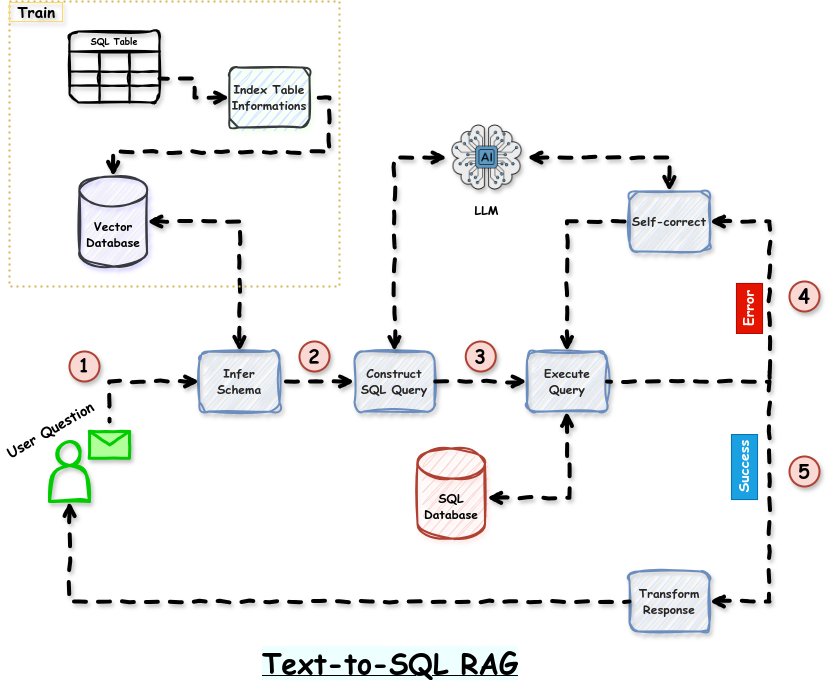

<h1 align="center">SQL Chatbot with LLM </h1>

Code by **Trong-Dat Ngo**.

## Introductions
Inspired by SQL Agent with its capabilities of automating construction sql qeury, execution, error self-correction, and response transformation while also overcoming its limitations like the inability to intervene in the thought process during execution, as well as the limits of context windows which could pose problems for large databases. My architecture revisits the core mechanism of SQL Agent, while enhancing customizability and extending the capability to handle large data and wider tables.

# Coming soon
- [x] Design the architecture
- [x] Choose the database for the experiment
- [ ] Implement the architecture
- [ ] Test the architecture
- [ ] Write the report